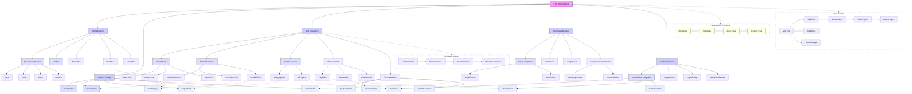

```mermaid
flowchart TD
    %% Main Site Functions with Optimized Layout
    Root["EMC West Website"] --> Navigation & Content & Interaction & Responsive & Media
    
    %% Navigation Function - Optimized
    Navigation["Site Navigation"] --> MainNav & SubNav & MobileNav & ScrollNav & FooterNav
    MainNav["Main Navigation Bar"] --> Home & Work & About & Contact
    
    %% Content Display - Optimized
    Content["Content Display"] --> HeroSection & TeamProfiles & ProjectGrid & ReelDisplay & ContactForm
    
    %% User Interaction - Optimized
    Interaction["User Interaction"] --> Hover & Scroll & Filter & VideoControl & FormValidation
    
    %% Hover Effects - Simplified
    Hover["Hover Effects"] --> CardHover & ButtonHover & NavHover
    
    %% Scroll Effects - Simplified
    Scroll["Scroll Animations"] --> RevealOnScroll & HeaderTransform & ParallaxEffect
    
    %% Filter - Simplified
    Filter["Portfolio Filtering"] --> CategoryFilter & AllProjects
    
    %% Video Controls - Simplified
    VideoControl["Video Controls"] --> PlayVideo & PauseVideo & HideControls
    
    %% Form Validation - Simplified
    FormValidation["Form Validation"] --> RequiredFields & EmailValidation & SubmitFeedback
    
    %% Responsive - Optimized
    Responsive["Responsive Behavior"] --> LayoutShift & FontResize & ImageResize & MenuTransform
    LayoutShift["Layout Adaptation"] --> SingleColumn & MultiColumn
    MenuTransform["Navigation Transformation"] --> HamburgerMenu & HorizontalMenu
    
    %% Media - Optimized
    Media["Media Integration"] --> VimeoPlayer & ImageGallery & LogoDisplay & BackgroundTexture
    VimeoPlayer["Vimeo Player Integration"] --> ReelVideo & ProjectVideos & CustomControls
    
    %% Functional Groups
    subgraph PageFunctions["Page-specific Functions"]
        HomePage["Homepage"] --- WorkPage["Work Page"] --- AboutPage["About Page"] --- ContactPage["Contact Page"]
    end
    
    subgraph UserJourney["User Journey"]
        Visit["Visit Site"] --> ViewReel & ReadAbout & SendMessage
        ViewReel --> BrowseWork --> FilterProjects --> WatchProject
    end
    
    subgraph AnimationSystem["Animation System"]
        LoadAnimation --> ScrollAnimation --> HoverAnimation --> InteractionAnimation
    end
    
    %% Key Functional Relationships
    RevealOnScroll -.-> TeamProfiles & ProjectGrid & ReelDisplay
    CategoryFilter -.-> ProjectGrid
    PlayVideo -.-> ReelVideo & ProjectVideos
    ScrollNav -.-> HeaderTransform
    FormValidation -.-> ContactForm
    
    %% Connect functional groups
    Root -.-> PageFunctions & UserJourney
    Interaction -.-> AnimationSystem
    
    %% Style
    classDef main fill:#f9f,stroke:#333,stroke-width:2px;
    classDef section fill:#ccf,stroke:#333,stroke-width:1px;
    classDef subsection fill:#ddf,stroke:#333,stroke-width:1px;
    classDef page fill:#ffd,stroke:#333,stroke-width:1px;
    classDef group fill:none,stroke:#999,stroke-width:1px,stroke-dasharray: 5 5;
    
    class Root main;
    class Navigation,Content,Interaction,Responsive,Media section;
    class MainNav,SubNav,HeroSection,TeamProfiles,Hover,Scroll,Filter,LayoutShift,VimeoPlayer subsection;
    class HomePage,WorkPage,AboutPage,ContactPage page;
    class PageFunctions,UserJourney,AnimationSystem group;
```